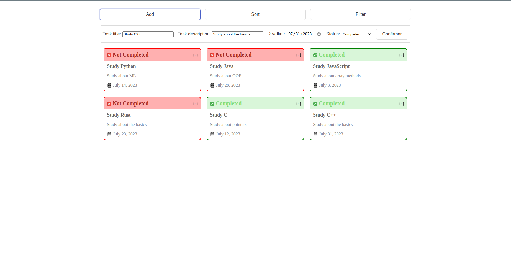

# Task Tracker

  <a href="https://joao4xz.github.io/task-tracker/">Live Preview</a>

Task tracker is application that allows you to add, sort, filter, and manage tasks through a simple user interface. The purpose of this project was to review and implement various concepts such as objects, array methods, flexbox, content sectioning, and pseudo classes.
